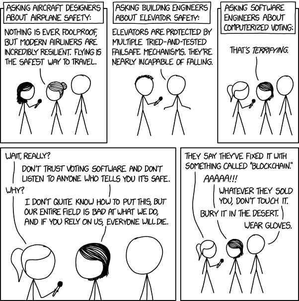

# Software isn't soft enough 

Don't trust software. 
The very name is misleading. Software isn't soft at all. 
It evolved from hardware engineering and bares it's legacy: 
It's binary, it's rigid, it's brittle. 
It's inspired by inanimate machines, not the organic animate. 
It aims for the certain and the exact but also relies on these and breaks when things are not so. 

The mechanical principles work well for simple systems with simple purposes -- such as buildings or vehicles -- 
but as systems becomes more complex and interconnected, 
we should expect the unexpected to be common. 

Software should be softer to allow enough wiggle room to absorb the 
shock of uncertainty. 

(Image from https://xkcd.com/2030/)

## To type or not to type

Softer software. 
So should we move away from the strong and static, embracing the weak and dynamic (talking about type)?

My opinion is that the question itself isn't soft enough, 
and that it reflects how far the binary legacy reaches.

Perhaps we need to allow languages to be where ever they need to be on 
the type (type) spectrum, according to what the context dictates. 
I vote for optional non-categorical types with non-categorical rules 
of interaction, defined by context-based configurable conventions.

If you know what I mean...

  

(Image from https://android.jlelse.eu/magic-lies-here-statically-typed-vs-dynamically-typed-languages-d151c7f95e2b)

