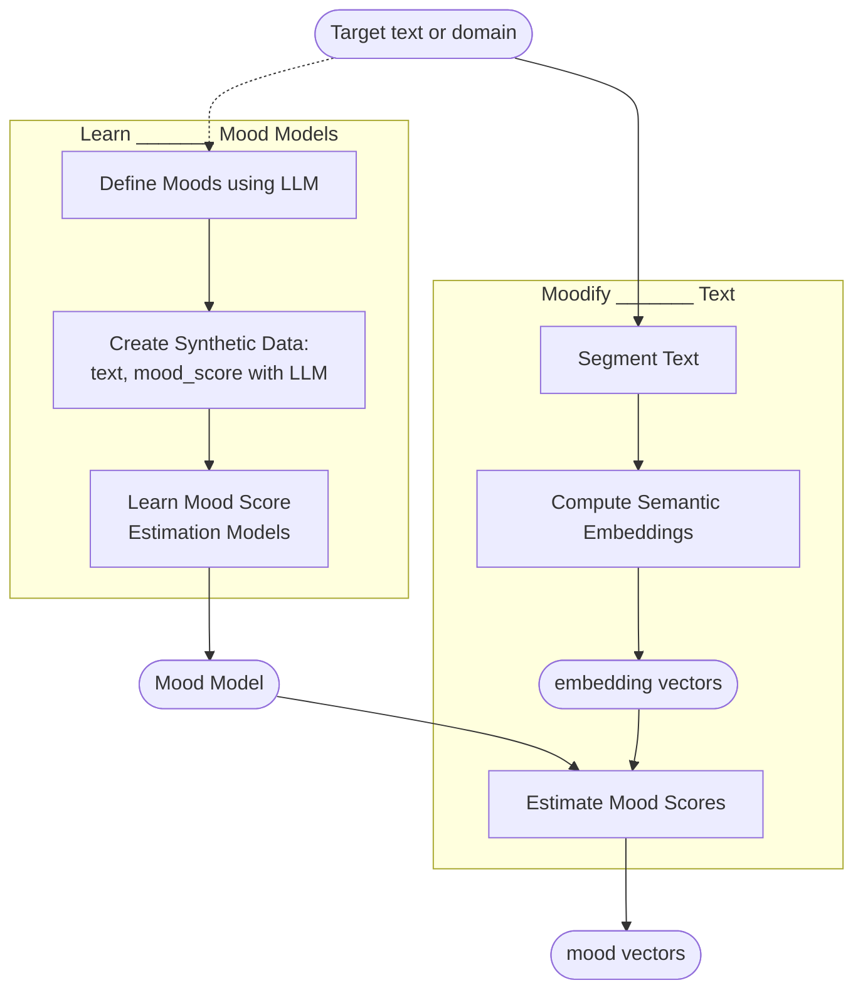

# Sonifying Semantics: Political Discourse

In this paper, we present methodologies for converting textual content into auditory representations that dynamically reflect variations in specific semantic attributes throughout the text. By mapping these semantic fluctuations to corresponding sonic parameters, we enable a nuanced auditory experience that encapsulates the evolving meanings within the discourse. 

To demonstrate these methods, we sonify [the transcript]((https://raw.githubusercontent.com/thorwhalen/content/refs/heads/master/text/trump-zelensky-2025-03-01--with_speakers.txt)) of the  Trump-Zelenskyy White House meeting of Feb 2025 (see [wikipedia page](https://en.wikipedia.org/wiki/2025_Trump%E2%80%93Zelenskyy_meeting)._)
We extract semantic attributes from the dialogue, develop models to detect and score these attributes, and apply the models to generate semantically meaningful feature vector sequences. These sequences are then sonified to create audio tracks, effectively transducing discourse into sound and enabling us to "head meaning" through auditory experience.

(Note: This transcript was obtained by applying speech-detection and speaker-identification models to the audio of the transcript, by 
[carlos](https://medium.com/@crbarahona), whose then [wrote this blog post about it](https://medium.com/@crbarahona/mapping-political-rhetoric-5fc03c51895f).)

## **Article Summary: “Sonifying Semantics: The sound of political discourse”**

### **Theoretical Framing: Vector Spaces as Cognitive Maps of Meaning**

We begin by framing **semantic embedding spaces** as the representational environments in which **Large Language Models (LLMs) “think.”** These spaces are not merely technical artifacts but serve as **cognitive maps** where meaning is encoded geometrically. Semantic similarity, analogy, and attributes emerge as **structural properties** of the space—distances, directions, and clusters—rather than symbolic forms. This aligns with the tradition of **distributional semantics**, now extended into the geometric and high-dimensional domains of deep learning.

### **Geometry of Semantics: Semantic Directions and Feature Spaces**

Next, we explore how **semantic relationships manifest as geometric transformations**—specifically, as directions or subspaces that correlate with attributes like gender, sentiment, political stance, or concreteness. These “semantic directions” are discovered through probing, supervised modeling, or unsupervised techniques, and they allow us to map **latent vector spaces** onto **interpretable semantic dimensions**. This process is not only analytical but **semiotic**: we convert geometric forms into meaningful interpretants.

### **Operationalizing Signification: Learning Semantic Projections**

Our methodological contribution is a system that uses LLMs and embedding space projections to transform texts into **interpretable sequences of semantic features**. We employ trained or finetuned projection layers—such as linear probes—to map LLM activations or embeddings onto chosen semantic targets. These projections allow us to **track the evolution of semantic attributes** over time in longer texts, such as political transcripts, producing **trajectories in semantic space** that reflect discursive structure and intent.

### **From Feature Space to Sound: Sonifying Semantic Signals**

We then translate these semantic trajectories into **sound**. This is more than arbitrary data sonification; it is a **semiotically coherent transformation**, where specific acoustic features (pitch, timbre, rhythm) are systematically mapped to semantic attributes (e.g., tension, formality, polarity). Through this process, **discourse is transduced into audio**, allowing us to **hear meaning as it unfolds** across a text. The result is a form of computational **semantic music**, grounded in the structure of language as understood by LLMs.

### **Artistic and Philosophical Framing**

Finally, we reflect on this system as a form of **computational hermeneutics**. Rather than merely analyzing meaning, we create a pipeline—text → embedding → semantic trajectory → audio—that allows LLMs to **participate in the aesthetic representation of meaning**. This positions AI not just as an analytic tool, but as a **co-interpreter and medium** in the signification of human language. In this sense, we propose a new mode of machine-assisted interpretation—**AI as a composer of semantic resonance**.


## Theoretical Framing: Vector Spaces as Cognitive Maps of Meaning

At the heart of our approach lies the premise that **semantic embedding spaces serve as cognitive maps** in which *Large Language Models* (LLMs) operate. These spaces are not neutral containers or purely computational artifacts; rather, they are **structured environments in which meaning is encoded and manipulated geometrically**.

LLMs trained on language prediction tasks (e.g., next-word prediction) generate internal representations of language in the form of high-dimensional vectors. Each token is mapped into a *point* in this space, and critically, **semantic relationships emerge as *geometric regularities***—distances reflect similarity, *directions* reflect transformations, and *clusters* encode categorical structure. This notion aligns with and expands upon the distributional hypothesis (Harris, 1954), long foundational in computational semantics.

We refer to this as the **geometry of meaning**, a term we adopt from prior work on semantic embedding transformations [see our research synthesis](https://github.com/thorwhalen/idiom/discussions/1). In this view, meaning is not defined *symbolically* but instead *emerges as topology*—a point’s location is meaningful only relative to other points in the space, and semantic operations are enacted through **vector transformations**.

This perspective is supported by a growing body of evidence. For instance, classic work with Word2Vec demonstrated that **analogical relationships correspond to linear transformations**, e.g., `king - man + woman ≈ queen` [Mikolov et al., 2013](http://arxiv.org/abs/1301.3781). More recent analyses extend this principle to contextualized models like BERT and GPT, where *semantic directions* have been identified for a wide array of attributes—gender, sentiment, even hierarchical syntactic depth [Hewitt & Manning, 2019; Chersoni et al., 2021](https://doi.org/10.1162/COLI_a_00412).

Notably, such geometric structures are not explicitly designed by the model’s creators but **emerge spontaneously** through the process of compressing rich linguistic contexts into vector form. As detailed by [Yin & Shen (2018)](https://arxiv.org/abs/1802.05883), this emergence can be attributed to **bias-variance tradeoffs** in the model’s dimensionality, which result in latent spaces that naturally encode meaningful relationships as a side effect of optimization.

This framing has profound implications:
- It allows us to **treat LLMs as implicit theorists of semantics**, whose internal structures can be analyzed to discover conceptual axes.
- It reframes interpretability as a **geometric recovery problem**—how can we reverse-engineer the latent structure of a language model to identify meaningful features?
- And it opens the door to new forms of *signification*, wherein **semantic structure becomes a signal** that can be transduced into other modalities—such as sound.

In this article, we explore precisely this opportunity. By identifying and learning *semantic projections*—functions that map general-purpose embeddings to interpretable dimensions—we convert political discourse into **trajectories in semantic feature space**. These trajectories, in turn, become inputs to **sonification systems**, allowing us to *hear* the evolving semantics of a conversation.

Thus, semantic embedding spaces are not only sites of linguistic structure, but **platforms for multi-modal interpretation**. They offer a computational geometry of meaning—one that bridges language and sound, representation and resonance.


## Geometry of Semantics: Semantic Directions and Feature Spaces

Having introduced semantic embedding spaces as cognitive environments for meaning-making, we now turn to a key structural insight: **semantic relationships often emerge in these spaces as geometric transformations**. This phenomenon enables us to interpret meaning through the *geometry of semantics*, wherein *directions* and *subspaces* within a high-dimensional vector space encode interpretable attributes such as *gender*, *sentiment*, *formality*, or *political stance*.

This emergent structure is not coincidental—it is a *computational necessity*. LLMs are trained to model language by predicting tokens based on vast amounts of contextualized text. To do so effectively, they must **compress an astronomical quantity of linguistic, world, and pragmatic knowledge** into a relatively constrained latent space (e.g., 768 or 1536 dimensions). As Yin and Shen (2018) describe in their work on the *bias-variance tradeoff* in word embedding dimensionality, this compression leads to optimization behaviors that favor representations that maximize expressivity per dimension [Yin & Shen, 2018](https://arxiv.org/abs/1802.05883).

To encode more information than the dimensionality naively allows, LLMs exploit **relational encodings**: semantic features are not stored in individual coordinates, but in **relative geometric arrangements**—*distances*, *vector offsets*, and *angles*. This phenomenon was first observed in classic embeddings like Word2Vec, where the analogy `king - man + woman ≈ queen` signaled that *gender* was aligned with a consistent vector direction [Mikolov et al., 2013]. Subsequent work has extended this intuition to a wide range of features, including abstract attributes like *formality* or *political valence* [Bolukbasi et al. (2016) — *Man is to Computer Programmer as Woman is to Homemaker?*](https://arxiv.org/abs/1607.06520).

To formalize this, we define a **semantic direction** as a vector or subspace that correlates with the variation of a particular semantic attribute across examples. These directions can be discovered in multiple ways:
- **Probing models**, such as logistic regression on frozen embeddings, identify interpretable axes through supervised learning [Hewitt & Manning, 2019].
- **Unsupervised subspace techniques**, like PCA or SVD, reveal dominant modes of variation that often correspond to salient linguistic traits [Yin & Shen, et al.  (2019) — *Subspace identification of individual systems in a large-scale heterogeneous network*](https://www.sciencedirect.com/science/article/abs/pii/S0005109819303784).
- **Alignment frameworks** map learned embeddings to predefined semantic feature spaces, such as those derived from brain-based or behavioral norms [Chersoni et al. (2021) — *Decoding Word Embeddings with Brain-Based Semantic Features*](https://doi.org/10.1162/COLI_a_00412).

While conceptually straightforward, this idea leads to a surprising question: *how many independent semantic directions can such a space meaningfully support?* After all, in an \( n \)-dimensional Euclidean space, one can define at most \( n \) mutually orthogonal directions. With the cosine similarity metric—ubiquitous in NLP—orthogonality corresponds to semantic independence. It might seem limiting to have only a few hundred dimensions.

However, here we encounter an unintuitive blessing of high-dimensional geometry. In **high-dimensional spaces, it is possible to pack exponentially many *nearly orthogonal* vectors**—directions that are *sufficiently uncorrelated* for practical separation, even if not perfectly orthogonal. This loosening of independence criteria allows us to discover and define **many semantically distinct and recoverable attributes** within a fixed space.

This property turns the so-called *curse of dimensionality* into an **interpretive advantage**. While high-dimensional models often suffer from generalization issues in other domains, here, the dimensional abundance provides **enough representational flexibility to encode diverse, fine-grained semantic features** as geometric patterns.

It is this richness that underpins the possibility of building **semantic attribute projection models**—models that map general-purpose embeddings to numerical scores reflecting specific attributes. Once such mappings are trained, they allow us to translate arbitrary text into a **semantic feature vector**—a point in a space of interpretants.

These interpretants form the substrate of our downstream goal: **semantic sonification**. By tracking the movement of text through selected semantic subspaces—such as aggression, hope, irony, or diplomatic intent—we can render these trajectories into sound. This turns the *invisible structure of discourse* into a *perceivable aesthetic object*.

The framework we describe thus rests on a deceptively simple idea: that **meaning can be *heard* through geometry**—but this simplicity is enabled by the deep structural ingenuity of language models and the latent affordances of high-dimensional space.

## Overview of the Text-to-Sound methodology



### **Learning – Building the Mood Model**

This phase constructs interpretable projection models from embeddings to semantic attributes.

*   _We collaborate with an LLM in a human-in-the-loop process to define a set of interpretable semantic attributes (e.g., “Blame Attribution”, “Diplomatic Politeness”, “Irony / Humor”) based on the target discourse (the Trump–Zelenskyy 2025 meeting)._→ See: [30 semantic attributes](https://github.com/thorwhalen/mood/discussions/5#discussioncomment-12643849)
    
*   _We generate training data by prompting an LLM to produce short text examples scored on a 0–5 scale for each semantic attribute, ensuring diversity in style, domain, tone, and perspective. This avoids expensive manual annotation while offering precision and scale._→ [Prompt template](https://github.com/thorwhalen/mood/discussions/5#discussioncomment-12643672)→ Addressed bias and representational diversity using a taxonomy of linguistic facets.
    
*   _Using this synthetic dataset, we train one projection model per semantic attribute (e.g., logistic regression or ridge regression probes) that maps embedding vectors to scalar mood scores. These projections become our “mood model.”_→ Each model learns to estimate the presence of a semantic feature from LLM-generated embeddings (e.g., text-embedding-3-small).
    
*   _Each text segment of the transcript is embedded to get a vector representation that captures its contextual and semantic content._→ We use OpenAI’s text-embedding-3-small (1536-dim).
    
*   _Each embedding vector is passed through the 30 mood model projections to produce a 30-dimensional “mood vector” representing the semantic signature of that segment._→ The result is a **semantic trajectory** over time—how attributes rise, fall, or interact across the discourse.
    
*   _These vectors are then used to create a **semantic sonification** of the transcript.
    

## Operationalizing Signification: Learning Semantic Projections

The core methodological contribution of our system lies in a pipeline that transforms text into a **sequence of semantic feature vectors**, which can then be rendered visually or sonically. At the heart of this pipeline is a set of **learned projections** that map contextual embeddings—generated by a Large Language Model (LLM)—onto interpretable dimensions, or *semantic attributes*. This process constitutes a form of *operationalized signification*, converting latent structures into semantically meaningful signals.

Our system is designed to support a wide range of applications—including the **semantic sonification**—by enabling precise tracking of emotional, rhetorical, and stylistic features across the timeline of a conversation. In doing so, it builds upon and extends a tradition of NLP research on sentiment and affect modeling, while leveraging the advances made possible by transformer-based LLMs.

### From Sentiment to Semantics—Beyond Classic Models

Traditionally, sentiment analysis has relied on lexicon-based or supervised models such as **VADER**, **NRCLex**, and **text2emotion**. These systems operate via rule-based keyword detection and affective lexicons, making them **fast and interpretable but brittle** in the face of irony, negation, or contextual nuance. For example, a phrase like “I stopped the war” may be scored negatively by such systems despite its positive valence in context [oai_citation:0‡Misc notes for mood.md](file-service://file-9yWv5WTvqCKTbuVqY8pLFD).

Recent developments have shifted toward **contextual embeddings** generated by LLMs (e.g., BERT, RoBERTa), which offer **richer, context-sensitive representations**. Fine-tuning these models on domain-specific datasets enables robust capture of complex sentiment phenomena such as **passive-aggressiveness**, **moral outrage**, or **provocation**. Libraries such as [Hugging Face Transformers](https://huggingface.co/), [Flair](https://github.com/flairNLP/flair), and [DeepMoji](https://github.com/bfelbo/DeepMoji) exemplify this transition.

Nevertheless, many existing tools were developed **before the LLM revolution**, and focus primarily on coarse-grained affect categories. Our work shows that **LLMs can now be repurposed to model a far broader spectrum of semantic properties**, such as *historical framing*, *victimhood*, *diplomatic tone*, or *peacebroker identity claims*, and at **a fraction of the traditional annotation cost**.

### Defining Semantic Attributes Using LLMs

We define *semantic attributes* as **interpretable conceptual dimensions** of a text—traits like "nationalistic sentiment", "blame attribution", or "emotion: hope". These correspond to psychological, rhetorical, or pragmatic categories, and serve as the target dimensions for our projection models [oai_citation:1‡mood_modeling.md](file-service://file-DPpva8sbwsR72ZH9fAsj4h).

To bootstrap this process, we used LLM prompting to **co-develop a list of 30 semantic attributes** that were relevant to our focal corpus: the transcript of the **Trump–Zelenskyy White House meeting (Feb 2025)**. This list was not generated in one pass; rather, it emerged through a **human-in-the-loop refinement dialogue with an LLM**, where we proposed, revised, and tested attribute definitions.

Each semantic attribute is defined with a **name, descriptive explanation, example snippet (from the transcript), and relevance (to the purpose of our analysis)**. 
This process yielded a robust and interpretable target space of 30 attributes, suitable for training projection models and semantic signal extraction (here's the [python dictionary used in code](https://github.com/thorwhalen/mood/discussions/5#discussioncomment-12643849)):


| #  | Semantic Attribute              | Description                                                                                          | Example Snippet                                                | Relevance                        |
|----|--------------------------------|------------------------------------------------------------------------------------------------------|----------------------------------------------------------------|----------------------------------|
| 1  | Diplomatic Politeness          | Degree of formality, civility, and ceremonial tone                                                   | "It's an honor to have you here."                             | Sets tone, highlights shifts     |
| 2  | Military Reference Intensity   | Mentions of soldiers, arms, tactics, or losses                                                       | "Thousands of soldiers have died."                            | Central topic                    |
| 3  | Blame Attribution              | Assigning fault or responsibility                                                                    | "Biden administration didn’t speak to Russia whatsoever."     | High—politically charged         |
| 4  | Self-Promotion / Credit Claiming| Speaker takes credit for progress or leadership                                                     | "We made a deal. That’s what changed."                        | Dominant rhetorical motif        |
| 5  | Praise / Admiration            | Expressions of respect for people or nations                                                         | "Your soldiers have been unbelievably brave."                 | Recurs in both speakers          |
| 6  | Appeal to Peace / De-escalation| Rhetoric aimed at ending war or violence                                                             | "We want to stop the war."                                    | Thematic core                    |
| 7  | Assertion Strength             | Certainty, confidence, definitive tone                                                               | "It would have never happened."                               | High contrast across speakers    |
| 8  | Factual vs. Speculative        | Degree of evidence-based vs. hypothetical claims                                                     | "If I were President, this war would never have happened."    | Shapes evidentiality layer       |
| 9  | Nationalistic Sentiment        | Pride in national identity, culture, or values                                                       | "We are defending Europe."                                    | Strong on both sides             |
| 10 | Historical Framing             | References to past presidents, treaties, timelines                                                   | "We signed the deal in 2019."                                 | Anchors geopolitical context     |
| 11 | Sentiment Polarity             | Positive or negative affective tone                                                                  | "This is tragic stuff."                                       | Baseline for emotional tone      |
| 12 | Interpersonal Engagement       | Direct address, personal pronouns, mutual referencing                                                | "Do you think that sort of a stupid question?"                | Governs dialogic energy          |
| 13 | Gratitude / Reciprocity        | Expressing thanks, acknowledgment of support                                                         | "We are thankful."                                            | Tied to tensions in tone         |
| 14 | Moral Outrage                  | Explicit condemnation of wrongdoing                                                                  | "He is a killer and terrorist."                               | Intensifies moral affect         |
| 15 | Victimhood Framing             | Emphasizing suffering, injustice, loss                                                               | "20,000 Ukrainian children were stolen."                      | High emotional impact            |
| 16 | Irony / Humor                  | Use of sarcasm, irony, jokes                                                                         | "I’m far superior to Washington and Lincoln — just kidding!" | Tonal shifts, attention peaks    |
| 17 | Hostility / Confrontation      | Tension or attack toward other speaker or entity                                                     | "You’re not in a good position."                              | Escalates in later turns         |
| 18 | Peacebroker Identity Claim     | Speaker positions themselves as mediator, neutral actor                                              | "I’m here as an arbitrator."                                  | Trump rhetorical self-positioning|
| 19 | Legitimacy Appeals             | Invocations of historical, moral, or legal legitimacy                                                | "They signed ceasefires and broke them 25 times."             | Justifies speaker's stance       |
| 20 | Emotion – Anger                | Explicit or latent expressions of anger                                                              | "You’re gambling with World War III."                         | Strong valence channel           |
| 21 | Emotion – Hope                 | Expressions of optimism, vision for improvement                                                      | "I hope we’ll stop him together."                             | Important for uplift contrasts   |
| 22 | Emotion – Despair / Tragedy    | Expressions of loss, hopelessness, grief                                                             | "50, 60 kilograms left... I didn’t want to show the children."| Triggers low-frequency affect    |
| 23 | Emotion – Pride                | National or personal pride in performance or ideals                                                  | "Ukraine is fighting and Ukraine lives."                      | Ethos / morale encoder           |
| 24 | Emotion – Fear / Threat        | Emphasis on danger, escalation, existential risk                                                     | "You're gambling with World War III."                         | Useful for dissonant sonification|
| 25 | Topic: Security Guarantees     | Talk focused on assurance, protection, NATO, deterrence                                              | "We need the air shield."                                     | Highly recurrent and salient     |
| 26 | Topic: Resource Negotiation    | Discussion of raw materials, infrastructure, economic exchange                                       | "We're going to be using the raw earth."                      | Pragmatic theme                  |
| 27 | Style: Informality / Casualness| Tone deviating from formal political discourse                                                       | "You know, this is going to be great television."             | Speaker contrast and tone breaks |
| 28 | Style: Urgency / Temporal Pressure | Expressing time sensitivity, immediate stakes                                                    | "Right now, people are dying on the battlefield."             | Peaks emotional rhythm           |
| 29 | Intent: Persuasion             | Rhetorical efforts to convince, redirect, justify                                                    | "This is a very good agreement for Ukraine."                  | Underlies strategic shifts       |
| 30 | Intent: Provocation / Challenge| Rhetorical barbs, challenges, baiting statements                                                     | "You don’t have the cards."                                   | Sharpens interpersonal dynamics  |


### Generating Synthetic Training Data with LLMs

To learn projections from embeddings to semantic attribute scores, we need labeled training data: short text segments annotated with intensity scores for each target attribute. While such data could be labeled by human annotators, we adopt an alternative strategy: **LLM-generated synthetic datasets**.

This approach offers several key benefits:
- **Scalability**: We can generate tens of thousands of diverse, labeled examples per attribute.
- **Control**: We can tune stylistic, topical, or rhetorical diversity using prompt engineering.
- **Consistency**: LLMs often yield more label-consistent outputs than small human annotator pools.

Even before the advent of LLMs, machine learning models could serve as *high-fidelity simulators* of human judgment in many domains. In some settings, **LLM-based labeling outperforms crowdsourced annotation** in terms of average agreement with the population signal. When combined with prompt templates and diversity controls, this method can produce **rich, balanced, and semantically calibrated datasets**. See [Tan et al. - Large Language Models for Data Annotation and Synthesis: A Survey](https://arxiv.org/abs/2402.13446v3), [Gilardi et al. - ChatGPT outperforms crowd workers for text-annotation tasks](https://arxiv.org/abs/2303.15056), [Zhang et al. - A Comparative Study on Annotation Quality of Crowdsourcing and LLM via Label Aggregation](https://arxiv.org/abs/2401.09760), and [Yan et al. - If in a Crowdsourced Data Annotation Pipeline, a GPT-4](https://arxiv.org/abs/2402.16795).

See the template we used for dataset generation below. It elicits 0–5 scores for attribute intensity across a range of synthetic segments, sampled from diverse topics, styles, and perspectives. Each attribute is modeled with **3,500–8,000 scored examples**, with balance between low, medium, and high-intensity instances.

```python
prompt_template_for_dataset_generation = """" \

You are tasked with generating labeled training data for a machine learning model that 
detects a specific semantic property in text. 
The goal is to produce short text segments (1–3 sentences each) 
that vary in how much they express the concept (a.k.a. "semantic attribute") of:
{concept}.

Please output a list of {num_examples} text examples. Each example should include:
	•	A short natural language text segment
	•	A semantic score from 0 to 5 (where 0 means “completely lacks the attribute”, and 5 means “maximally expresses the attribute”)

The score should reflect the degree to which the concept is present in the text. 
You should include examples across the full spectrum — some clearly negative, 
some ambiguous or mixed, and some highly prototypical.

The examples should also be:
	•	Varied in topic (e.g. politics, health, personal life, business, art)
	•	Varied in writing style (e.g. casual, formal, poetic, argumentative)
	•	Expressed from diverse perspectives and tones
	•	In natural, fluent English

The output format must be:
	•	One example per line
	•	Each line should have a score, followed by a TAB character, then the text segment
	•	No extra commentary, headers, or explanations — only the list

"""
```

We used this prompt to generate datasets, using the `gpt-4o-mini` OpenAI model with `temperature` set to `0.7` (to get a bit more variety than by default). We used the [oa](https://pypi.org/project/oa/) package to make a python function from the prompt template, then looped over all 30 target attributes, asking (from 35 to 70 times) for 100 examples. 
More details can be found in [this notebook](https://github.com/thorwhalen/mood/blob/main/misc/trump_zelenskyy_moods.ipynb) 

```python
from functools import partial
import oa 

get_semantic_attribute_data = oa.prompt_function(
    prompt_template_for_dataset_generation,
    prompt_func=partial(oa.chat, temperature=0.7, model='gpt-4o-mini'),
)
```


### A few design choice reflections

#### Scoring Semantics: Labels, Ranges, and Segment Design

Several additional design choices were crucial:
- **Label Format**: We opted for **0–5 integer scores**, striking a balance between **regression sensitivity** and **interpretability**. These can easily be binarized or used in ordinal modeling, and work well for visual/sonic mapping.
- **Segment Length**: We limited inputs to *1–3 sentence segments*, ensuring the scope remains local enough for interpretability, while broad enough for contextual cues.
- **Scoring Methodology**: Labels can be generated using **prompted judgment** (e.g., “How strongly does this text express [concept]?”), with scores reflecting gradient intensity.

We also considered the influence of **segment context** on meaning.  Embedding short utterances in isolation can lead to **semantic underdetermination**.  Several methods exist to mitigate this; for instance, at the analysis stage, segments could be embedded within **windowed discourse units** using either **highlighted spans** or **positional anchors** to allow the model to incorporate surrounding contextual cues while preserving the target signal.  However, the benefits of this approach must be weighed against the increased computational cost.  For the present purpose of deriving "semantic signals" for subsequent sonification, the potential for minor contextual errors was deemed an acceptable trade-off for reduced complexity.

#### Bias Management and Aspect Control

When generating data with LLMs, it's important to **manage bias and aspect correlation**. For instance, a model trained on text where sarcasm always co-occurs with informality might mistake tone for content.

To address this, our prompt design and sampling strategy explicitly control for:
- **Topic diversity** (politics, health, art, personal life)
- **Stylistic variation** (formal/informal, poetic/journalistic)
- **Perspective and stance** (first-person, institutional, ironic)
- **Register and genre** (speech, tweet, dialogue, narrative)

This control ensures that **semantic projection models generalize** across expression types, and do not conflate style with semantics.

### Toward Semantic Trajectories

The result of this process is a set of **attribute-specific projection models**, each of which maps embedding vectors to scalar scores for a given semantic attribute. Applied to a segmented transcript, these projections yield a **time series of feature vectors**—a *semantic trajectory* through meaning space.

In subsequent sections, we show how these trajectories can be **sonified**, using the evolving dynamics of rhetorical tone, emotional charge, or strategic framing to drive **audio synthesis** and **musical representation**.

This system enables us to *hear the movement of meaning*—to transform discourse not just into numbers, but into *aesthetic events* in sound.


## Datasets

The datasets produced can be found [here](https://github.com/thorwhalen/mood_files/tree/main/datasets).
Below is a table listing how many points each dataset has. 
The variability comes both from multiple runs during testing (we didn't want to throw away any data, so kept the data from those runs) as well as deduplication (some datasets produced more duplicates than others).


| semantic_attribute       |   number_of_examples |
|--------------------------|----------------------|
| irony_humor              |                 3620 |
| nationalistic_sentiment  |                 3265 |
| emotion_fear             |                 5488 |
| style_urgency            |                 4050 |
| interpersonal_engagement |                 5451 |
| factual_speculative      |                 4034 |
| style_informality        |                 7540 |
| emotion_anger            |                 4464 |
| blame_attribution        |                 3808 |
| peacebroker_claim        |                 4346 |
| topic_resource           |                 4879 |
| intent_provocation       |                 3872 |
| military_intensity       |                 3959 |
| emotion_pride            |                 3546 |
| gratitude_reciprocity    |                 3781 |
| topic_security           |                 4454 |
| emotion_hope             |                 4279 |
| hostility_confrontation  |                 3860 |
| peace_appeal             |                 3810 |
| victimhood_framing       |                 3660 |
| moral_outrage            |                 4152 |
| emotion_despair          |                 4619 |
| praise_admiration        |                 3694 |
| self_promotion           |                 4476 |
| assertion_strength       |                 4512 |
| legitimacy_appeals       |                 3654 |
| diplomatic_politeness    |                 4668 |
| sentiment_polarity       |                 3732 |
| historical_framing       |                 3861 |
| intent_persuasion        |                 4298 |


Here are, for example, the first 12 lines of the [diplomatic_politeness.txt](https://raw.githubusercontent.com/thorwhalen/mood_files/refs/heads/main/datasets/diplomatic_politeness.txt) file.

```
5 It's an honor to welcome you to our gathering today, where we celebrate our shared achievements.
4 Thank you for taking the time to meet with me; your insights are invaluable to our discussion.
3 I appreciate your input on this matter, and I think we can find a way to collaborate effectively.
2 I see your point, but I think we might have to reconsider some of your suggestions.
1 Frankly, I don’t think your ideas are going to work in this situation.
0 Your opinion doesn’t really matter here.
5 It is with great pleasure that I present to you our findings on this important issue.
4 We are truly grateful for your participation in this vital conversation.
3 I think what you’re saying has merit, but let’s dig a little deeper into the data.
2 While I understand your perspective, I don’t fully agree with your conclusion.
1 Honestly, that approach seems misguided and impractical.
0 We don’t need to waste time on your irrelevant comments.
```


# Modeling Semantic Attributes from Embedding Space

To learn how to map language to semantic attributes, we trained a series of machine learning models using LLM-generated datasets. Each data point consists of a short text segment and a scalar *mood score* ranging from 0 to 5 for a given semantic attribute (e.g., "Irony", "Nationalism", "Blame Attribution"). Our objective was to build projection functions that could take as input a semantic embedding of the text and return a real-valued estimate (or binary classification) of the intensity of a particular attribute.

## **Data Preprocessing: Embedding and Dimensionality Reduction**

All text segments were embedded using **OpenAI's `text-embedding-3-small` model**, which produces a 1536-dimensional embedding per segment. For each semantic attribute, we joined the segment’s embedding vector with its corresponding LLM-generated score using the text as the join key.

To **mitigate overfitting** and improve model stability, we reduced each embedding vector to its **first 300 dimensions**. This reduction is not arbitrary: OpenAI embeddings are designed so that the earliest coordinates contain the **most informative and generalizable semantic features**. This strategy functions as a **semantically aware dimensionality reduction** method, reducing model complexity without discarding useful signal.

For **binary classification models**, we converted the 0–5 scalar labels into binary categories by thresholding: lower scores (e.g., 0–2) were mapped to 0 (absent or weak), and higher scores (e.g., 3–5) were mapped to 1 (present or strong). This enabled us to build both **regression-style** and **classification-style** semantic probes.


## **Model Types and Configuration**

We implemented a set of interpretable, fast-to-train models for different types of semantic targets—**numerical**, **binary**, and **ordinal**. All models were built using `scikit-learn`, except for the `OrdinalRandomForest`, which is a custom implementation.

Below is a summary of the model types, configuration parameters, and output scaling strategies:

| **Model Name**         | **Data Type** | **sklearn Class**                  | **Key Parameters**                                                                 | **Output Transform** | **Dims Used** |
|------------------------|---------------|------------------------------------|-------------------------------------------------------------------------------------|----------------------|---------------|
| `linear_regression`    | numerical     | `Ridge`                            | `alpha=1.0`                                                                         | `sigmoid`            | 300           |
| `svr`                  | numerical     | `SVR`                              | `C=1.0`, `kernel='linear'`                                                          | `minmax`             | 300           |
| `logistic_high_vs_low` | binary        | `LogisticRegression`               | `C=1.0`, `class_weight='balanced'`                                                  | `sigmoid`            | 300           |
| `svm_high_vs_low`      | binary        | `SVC`                              | `C=1.0`, `kernel='linear'`, `probability=True`                                      | `sigmoid`            | 300           |
| `ordinal_svm`          | ordinal       | `SVC`                              | `C=1.0`, `kernel='linear'`, `decision_function_shape='ovo'`, `probability=True`     | `minmax`             | 300           |
| `ordinal_forest`       | ordinal       | `OrdinalRandomForest` *(custom)*   | `n_estimators=100`, `max_depth=10`, `min_samples_split=5`                           | `minmax`             | 300           |

The **output transformation** step ensures that model outputs fall into a common [0, 1] range, which is particularly important for downstream applications like **semantic trajectory plotting** and **sound synthesis**, where scale uniformity across dimensions is essential.


## **Learning Semantic Projections**

Each model effectively learns a projection \( f: \mathbb{R}^{300} \rightarrow [0, 1] \) that estimates the presence or intensity of a single semantic feature. Because embeddings already encode rich contextual and semantic structure, even simple models like **ridge regression or linear SVMs** perform surprisingly well. This aligns with prior findings in probing literature that linear probes suffice to reveal semantic information latent in LLM representations [Hewitt & Liang, 2019](https://arxiv.org/abs/1905.05950).

In future sections, we use these trained models to evaluate *naturalistic transcripts*—such as the Trump–Zelenskyy exchange—segment by segment, generating **semantic time-series** that reflect evolving tone, rhetorical stance, and emotional charge.

These trajectories form the substrate for **sonification**, enabling us to transform the **geometry of discourse** into **the music of meaning**.


## Model performance statistics

This analysis compares different classification models across semantic attributes to identify which models perform best overall and which semantic attributes are most effectively modeled by classification approaches.

### Model Comparison by Accuracy

*This table shows how different classification models perform across semantic attributes, with rows sorted by average accuracy. Higher values indicate better performance.*

|    | semantic_attribute       |   logistic_high_vs_low |   svm_high_vs_low |   Average |
|---:|:-------------------------|-----------------------:|------------------:|----------:|
|  0 | intent_persuasion        |                  0.992 |             0.994 |     0.993 |
|  1 | assertion_strength       |                  0.989 |             0.993 |     0.991 |
|  2 | emotion_anger            |                  0.988 |             0.991 |     0.989 |
|  3 | praise_admiration        |                  0.986 |             0.989 |     0.987 |
|  4 | sentiment_polarity       |                  0.986 |             0.988 |     0.987 |
|  5 | moral_outrage            |                  0.984 |             0.988 |     0.986 |
|  6 | emotion_fear             |                  0.971 |             0.977 |     0.974 |
|  7 | emotion_pride            |                  0.968 |             0.975 |     0.972 |
|  8 | legitimacy_appeals       |                  0.969 |             0.97  |     0.97  |
|  9 | emotion_despair          |                  0.963 |             0.975 |     0.969 |
| 10 | diplomatic_politeness    |                  0.953 |             0.972 |     0.963 |
| 11 | emotion_hope             |                  0.954 |             0.956 |     0.955 |
| 12 | hostility_confrontation  |                  0.947 |             0.954 |     0.951 |
| 13 | gratitude_reciprocity    |                  0.941 |             0.956 |     0.948 |
| 14 | peacebroker_claim        |                  0.938 |             0.944 |     0.941 |
| 15 | blame_attribution        |                  0.932 |             0.941 |     0.937 |
| 16 | intent_provocation       |                  0.919 |             0.933 |     0.926 |
| 17 | style_urgency            |                  0.92  |             0.926 |     0.923 |
| 18 | peace_appeal             |                  0.911 |             0.922 |     0.916 |
| 19 | military_intensity       |                  0.906 |             0.913 |     0.91  |
| 20 | self_promotion           |                  0.898 |             0.916 |     0.907 |
| 21 | style_informality        |                  0.891 |             0.903 |     0.897 |
| 22 | topic_security           |                  0.889 |             0.896 |     0.892 |
| 23 | victimhood_framing       |                  0.885 |             0.895 |     0.89  |
| 24 | nationalistic_sentiment  |                  0.87  |             0.883 |     0.877 |
| 25 | interpersonal_engagement |                  0.872 |             0.88  |     0.876 |
| 26 | topic_resource           |                  0.85  |             0.874 |     0.862 |
| 27 | historical_framing       |                  0.856 |             0.861 |     0.859 |
| 28 | factual_speculative      |                  0.818 |             0.831 |     0.825 |
| 29 | irony_humor              |                  0.699 |             0.703 |     0.701 |


### Semantic Attribute Modelability

*This table ranks semantic attributes by how accurately they can be modeled, with additional performance metrics for comprehensive evaluation. Higher values indicate attributes that are easier to model.*

|    | semantic_attribute       |   accuracy |   precision |   recall |    f1 |
|---:|:-------------------------|-----------:|------------:|---------:|------:|
|  0 | intent_persuasion        |      0.993 |       0.983 |    0.997 | 0.99  |
|  1 | assertion_strength       |      0.991 |       0.986 |    0.988 | 0.987 |
|  2 | emotion_anger            |      0.989 |       0.979 |    0.99  | 0.984 |
|  3 | praise_admiration        |      0.987 |       0.965 |    0.999 | 0.981 |
|  4 | sentiment_polarity       |      0.987 |       0.975 |    0.985 | 0.98  |
|  5 | moral_outrage            |      0.986 |       0.968 |    0.991 | 0.979 |
|  6 | emotion_fear             |      0.974 |       0.939 |    0.986 | 0.962 |
|  7 | emotion_pride            |      0.972 |       0.93  |    0.99  | 0.959 |
|  8 | legitimacy_appeals       |      0.97  |       0.951 |    0.959 | 0.954 |
|  9 | emotion_despair          |      0.969 |       0.931 |    0.983 | 0.956 |
| 10 | diplomatic_politeness    |      0.963 |       0.917 |    0.979 | 0.947 |
| 11 | emotion_hope             |      0.955 |       0.968 |    0.941 | 0.954 |
| 12 | hostility_confrontation  |      0.951 |       0.9   |    0.96  | 0.928 |
| 13 | gratitude_reciprocity    |      0.948 |       0.901 |    0.955 | 0.926 |
| 14 | peacebroker_claim        |      0.941 |       0.88  |    0.954 | 0.915 |
| 15 | blame_attribution        |      0.937 |       0.871 |    0.95  | 0.908 |
| 16 | intent_provocation       |      0.926 |       0.868 |    0.922 | 0.892 |
| 17 | style_urgency            |      0.923 |       0.945 |    0.897 | 0.92  |
| 18 | peace_appeal             |      0.916 |       0.856 |    0.905 | 0.879 |
| 19 | military_intensity       |      0.91  |       0.91  |    0.905 | 0.907 |
| 20 | self_promotion           |      0.907 |       0.831 |    0.909 | 0.867 |
| 21 | style_informality        |      0.897 |       0.89  |    0.903 | 0.896 |
| 22 | topic_security           |      0.892 |       0.785 |    0.931 | 0.852 |
| 23 | victimhood_framing       |      0.89  |       0.915 |    0.858 | 0.885 |
| 24 | nationalistic_sentiment  |      0.877 |       0.886 |    0.864 | 0.875 |
| 25 | interpersonal_engagement |      0.876 |       0.831 |    0.917 | 0.871 |
| 26 | topic_resource           |      0.862 |       0.757 |    0.866 | 0.806 |
| 27 | historical_framing       |      0.859 |       0.843 |    0.875 | 0.858 |
| 28 | factual_speculative      |      0.825 |       0.812 |    0.84  | 0.825 |
| 29 | irony_humor              |      0.701 |       0.656 |    0.742 | 0.696 |


**Figure 1:** Model comparison across semantic attributes: Shows how different models perform on each semantic attribute


**Figure 2a:** Most modelable attributes (saved as `top_modelable_attributes.png`): Shows the 5 semantic attributes that are most accurately modeled


**Figure 2b:** Least modelable attributes (saved as `bottom_modelable_attributes.png`): Shows the 5 semantic attributes that are most difficult to model accurately


**Figure 3:** Distribution of metrics across attributes (saved as `metric_distributions.png`): Shows the variability of performance metrics across different semantic attributes


## Regression Model Analysis

This analysis evaluates different regression models across semantic attributes to determine which regression approaches are most effective and which semantic attributes can be modeled with greater precision using regression techniques.

### Regression Model Comparison (R²)

*This table compares regression models across semantic attributes using R² (coefficient of determination). Higher values indicate models that explain more variance in the data.*

|    | semantic_attribute       |   linear_regression |   ordinal_forest |   ordinal_svm |   svr |   Average |
|---:|:-------------------------|--------------------:|-----------------:|--------------:|------:|----------:|
|  0 | gratitude_reciprocity    |               0.918 |            0.895 |         0.938 | 0.925 |     0.919 |
|  1 | diplomatic_politeness    |               0.906 |            0.87  |         0.922 | 0.906 |     0.901 |
|  2 | assertion_strength       |               0.89  |            0.837 |         0.925 | 0.896 |     0.887 |
|  3 | peacebroker_claim        |               0.887 |            0.862 |         0.904 | 0.892 |     0.886 |
|  4 | emotion_hope             |               0.885 |            0.837 |         0.907 | 0.888 |     0.879 |
|  5 | intent_persuasion        |               0.885 |            0.833 |         0.909 | 0.889 |     0.879 |
|  6 | praise_admiration        |               0.89  |            0.831 |         0.901 | 0.892 |     0.879 |
|  7 | emotion_anger            |               0.882 |            0.838 |         0.902 | 0.886 |     0.877 |
|  8 | emotion_pride            |               0.888 |            0.832 |         0.891 | 0.891 |     0.876 |
|  9 | style_urgency            |               0.881 |            0.835 |         0.883 | 0.886 |     0.871 |
| 10 | emotion_despair          |               0.854 |            0.812 |         0.88  | 0.856 |     0.851 |
| 11 | nationalistic_sentiment  |               0.857 |            0.809 |         0.868 | 0.865 |     0.85  |
| 12 | emotion_fear             |               0.854 |            0.795 |         0.88  | 0.855 |     0.846 |
| 13 | sentiment_polarity       |               0.851 |            0.775 |         0.892 | 0.855 |     0.843 |
| 14 | legitimacy_appeals       |               0.85  |            0.763 |         0.85  | 0.852 |     0.829 |
| 15 | military_intensity       |               0.84  |            0.78  |         0.833 | 0.84  |     0.823 |
| 16 | victimhood_framing       |               0.827 |            0.761 |         0.832 | 0.833 |     0.813 |
| 17 | moral_outrage            |               0.822 |            0.752 |         0.82  | 0.823 |     0.804 |
| 18 | topic_security           |               0.823 |            0.761 |         0.802 | 0.826 |     0.803 |
| 19 | peace_appeal             |               0.796 |            0.747 |         0.835 | 0.803 |     0.795 |
| 20 | hostility_confrontation  |               0.817 |            0.758 |         0.786 | 0.818 |     0.795 |
| 21 | self_promotion           |               0.801 |            0.747 |         0.816 | 0.81  |     0.793 |
| 22 | topic_resource           |               0.812 |            0.745 |         0.797 | 0.817 |     0.793 |
| 23 | blame_attribution        |               0.795 |            0.705 |         0.803 | 0.797 |     0.775 |
| 24 | style_informality        |               0.787 |            0.697 |         0.806 | 0.79  |     0.77  |
| 25 | interpersonal_engagement |               0.766 |            0.689 |         0.746 | 0.766 |     0.742 |
| 26 | historical_framing       |               0.723 |            0.635 |         0.668 | 0.724 |     0.687 |
| 27 | intent_provocation       |               0.702 |            0.639 |         0.671 | 0.713 |     0.681 |
| 28 | factual_speculative      |               0.578 |            0.491 |         0.542 | 0.576 |     0.547 |
| 29 | irony_humor              |               0.44  |            0.322 |         0.161 | 0.425 |     0.337 |

### Regression Modelability by Attribute

*This table ranks semantic attributes by how well they can be modeled using regression techniques. Higher R² and lower error metrics indicate attributes that are more effectively modeled.*

|    | semantic_attribute       |    r2 |   mean_squared_error |   mean_absolute_error |
|---:|:-------------------------|------:|---------------------:|----------------------:|
|  0 | gratitude_reciprocity    | 0.919 |                0.125 |                 0.147 |
|  1 | diplomatic_politeness    | 0.901 |                0.155 |                 0.179 |
|  2 | assertion_strength       | 0.887 |                0.178 |                 0.183 |
|  3 | peacebroker_claim        | 0.886 |                0.176 |                 0.196 |
|  4 | emotion_hope             | 0.879 |                0.192 |                 0.206 |
|  5 | intent_persuasion        | 0.879 |                0.194 |                 0.21  |
|  6 | praise_admiration        | 0.879 |                0.201 |                 0.219 |
|  7 | emotion_anger            | 0.877 |                0.194 |                 0.214 |
|  8 | emotion_pride            | 0.876 |                0.209 |                 0.222 |
|  9 | style_urgency            | 0.871 |                0.211 |                 0.228 |
| 10 | emotion_despair          | 0.851 |                0.23  |                 0.244 |
| 11 | nationalistic_sentiment  | 0.85  |                0.242 |                 0.243 |
| 12 | emotion_fear             | 0.846 |                0.244 |                 0.257 |
| 13 | sentiment_polarity       | 0.843 |                0.251 |                 0.249 |
| 14 | legitimacy_appeals       | 0.829 |                0.29  |                 0.281 |
| 15 | military_intensity       | 0.823 |                0.284 |                 0.267 |
| 16 | victimhood_framing       | 0.813 |                0.306 |                 0.29  |
| 17 | moral_outrage            | 0.804 |                0.32  |                 0.296 |
| 18 | topic_security           | 0.803 |                0.323 |                 0.309 |
| 19 | peace_appeal             | 0.795 |                0.315 |                 0.301 |
| 20 | hostility_confrontation  | 0.795 |                0.341 |                 0.312 |
| 21 | self_promotion           | 0.793 |                0.328 |                 0.295 |
| 22 | topic_resource           | 0.793 |                0.33  |                 0.308 |
| 23 | blame_attribution        | 0.775 |                0.367 |                 0.324 |
| 24 | style_informality        | 0.77  |                0.37  |                 0.325 |
| 25 | interpersonal_engagement | 0.742 |                0.377 |                 0.331 |
| 26 | historical_framing       | 0.687 |                0.501 |                 0.395 |
| 27 | intent_provocation       | 0.681 |                0.518 |                 0.39  |
| 28 | factual_speculative      | 0.547 |                0.714 |                 0.461 |
| 29 | irony_humor              | 0.337 |                1.029 |                 0.624 |


**Figure 4:** Regression model comparison: Compares R² values across models and semantic attributes for numerical data


**Figure 5a:** Most modelable attributes for regression: Shows the 5 semantic attributes that are most effectively modeled with regression


**Figure 5b:** Least modelable attributes for regression: Shows the 5 semantic attributes that are most difficult to model with regression


## Cross-Dataset Comparison Analysis

This analysis compares classification and regression approaches to identify which modeling paradigm is more effective for each semantic attribute and to determine if certain attributes are better suited to one approach over the other.
Analyzing 30 semantic attributes that appear in both datasets.

### Best Classifiers per Attribute

*This table shows which classification models perform best for each semantic attribute.*

|    | semantic_attribute       |   logistic_high_vs_low |   svm_high_vs_low |   Average |
|---:|:-------------------------|-----------------------:|------------------:|----------:|
|  0 | intent_persuasion        |                  0.992 |             0.994 |     0.993 |
|  1 | assertion_strength       |                  0.989 |             0.993 |     0.991 |
|  2 | emotion_anger            |                  0.988 |             0.991 |     0.989 |
|  3 | praise_admiration        |                  0.986 |             0.989 |     0.987 |
|  4 | sentiment_polarity       |                  0.986 |             0.988 |     0.987 |
|  5 | moral_outrage            |                  0.984 |             0.988 |     0.986 |
|  6 | emotion_fear             |                  0.971 |             0.977 |     0.974 |
|  7 | emotion_pride            |                  0.968 |             0.975 |     0.972 |
|  8 | legitimacy_appeals       |                  0.969 |             0.97  |     0.97  |
|  9 | emotion_despair          |                  0.963 |             0.975 |     0.969 |
| 10 | diplomatic_politeness    |                  0.953 |             0.972 |     0.963 |
| 11 | emotion_hope             |                  0.954 |             0.956 |     0.955 |
| 12 | hostility_confrontation  |                  0.947 |             0.954 |     0.951 |
| 13 | gratitude_reciprocity    |                  0.941 |             0.956 |     0.948 |
| 14 | peacebroker_claim        |                  0.938 |             0.944 |     0.941 |
| 15 | blame_attribution        |                  0.932 |             0.941 |     0.937 |
| 16 | intent_provocation       |                  0.919 |             0.933 |     0.926 |
| 17 | style_urgency            |                  0.92  |             0.926 |     0.923 |
| 18 | peace_appeal             |                  0.911 |             0.922 |     0.916 |
| 19 | military_intensity       |                  0.906 |             0.913 |     0.91  |
| 20 | self_promotion           |                  0.898 |             0.916 |     0.907 |
| 21 | style_informality        |                  0.891 |             0.903 |     0.897 |
| 22 | topic_security           |                  0.889 |             0.896 |     0.892 |
| 23 | victimhood_framing       |                  0.885 |             0.895 |     0.89  |
| 24 | nationalistic_sentiment  |                  0.87  |             0.883 |     0.877 |
| 25 | interpersonal_engagement |                  0.872 |             0.88  |     0.876 |
| 26 | topic_resource           |                  0.85  |             0.874 |     0.862 |
| 27 | historical_framing       |                  0.856 |             0.861 |     0.859 |
| 28 | factual_speculative      |                  0.818 |             0.831 |     0.825 |
| 29 | irony_humor              |                  0.699 |             0.703 |     0.701 |


### Best Regression Models per Attribute

*This table shows which regression models perform best for each semantic attribute.*

|    | semantic_attribute       |   linear_regression |   ordinal_forest |   ordinal_svm |   svr |   Average |
|---:|:-------------------------|--------------------:|-----------------:|--------------:|------:|----------:|
|  0 | gratitude_reciprocity    |               0.918 |            0.895 |         0.938 | 0.925 |     0.919 |
|  1 | diplomatic_politeness    |               0.906 |            0.87  |         0.922 | 0.906 |     0.901 |
|  2 | assertion_strength       |               0.89  |            0.837 |         0.925 | 0.896 |     0.887 |
|  3 | peacebroker_claim        |               0.887 |            0.862 |         0.904 | 0.892 |     0.886 |
|  4 | emotion_hope             |               0.885 |            0.837 |         0.907 | 0.888 |     0.879 |
|  5 | intent_persuasion        |               0.885 |            0.833 |         0.909 | 0.889 |     0.879 |
|  6 | praise_admiration        |               0.89  |            0.831 |         0.901 | 0.892 |     0.879 |
|  7 | emotion_anger            |               0.882 |            0.838 |         0.902 | 0.886 |     0.877 |
|  8 | emotion_pride            |               0.888 |            0.832 |         0.891 | 0.891 |     0.876 |
|  9 | style_urgency            |               0.881 |            0.835 |         0.883 | 0.886 |     0.871 |
| 10 | emotion_despair          |               0.854 |            0.812 |         0.88  | 0.856 |     0.851 |
| 11 | nationalistic_sentiment  |               0.857 |            0.809 |         0.868 | 0.865 |     0.85  |
| 12 | emotion_fear             |               0.854 |            0.795 |         0.88  | 0.855 |     0.846 |
| 13 | sentiment_polarity       |               0.851 |            0.775 |         0.892 | 0.855 |     0.843 |
| 14 | legitimacy_appeals       |               0.85  |            0.763 |         0.85  | 0.852 |     0.829 |
| 15 | military_intensity       |               0.84  |            0.78  |         0.833 | 0.84  |     0.823 |
| 16 | victimhood_framing       |               0.827 |            0.761 |         0.832 | 0.833 |     0.813 |
| 17 | moral_outrage            |               0.822 |            0.752 |         0.82  | 0.823 |     0.804 |
| 18 | topic_security           |               0.823 |            0.761 |         0.802 | 0.826 |     0.803 |
| 19 | peace_appeal             |               0.796 |            0.747 |         0.835 | 0.803 |     0.795 |
| 20 | hostility_confrontation  |               0.817 |            0.758 |         0.786 | 0.818 |     0.795 |
| 21 | self_promotion           |               0.801 |            0.747 |         0.816 | 0.81  |     0.793 |
| 22 | topic_resource           |               0.812 |            0.745 |         0.797 | 0.817 |     0.793 |
| 23 | blame_attribution        |               0.795 |            0.705 |         0.803 | 0.797 |     0.775 |
| 24 | style_informality        |               0.787 |            0.697 |         0.806 | 0.79  |     0.77  |
| 25 | interpersonal_engagement |               0.766 |            0.689 |         0.746 | 0.766 |     0.742 |
| 26 | historical_framing       |               0.723 |            0.635 |         0.668 | 0.724 |     0.687 |
| 27 | intent_provocation       |               0.702 |            0.639 |         0.671 | 0.713 |     0.681 |
| 28 | factual_speculative      |               0.578 |            0.491 |         0.542 | 0.576 |     0.547 |
| 29 | irony_humor              |               0.44  |            0.322 |         0.161 | 0.425 |     0.337 |


### Most Modelable Attributes (Classification)

*This table ranks semantic attributes by how well they can be modeled using classification approaches.*

|    | semantic_attribute       |   accuracy |    f1 |   roc_auc |
|---:|:-------------------------|-----------:|------:|----------:|
|  0 | intent_persuasion        |      0.993 | 0.99  |     1     |
|  1 | assertion_strength       |      0.991 | 0.987 |     0.999 |
|  2 | emotion_anger            |      0.989 | 0.984 |     0.999 |
|  3 | praise_admiration        |      0.987 | 0.981 |     0.997 |
|  4 | sentiment_polarity       |      0.987 | 0.98  |     0.994 |
|  5 | moral_outrage            |      0.986 | 0.979 |     0.998 |
|  6 | emotion_fear             |      0.974 | 0.962 |     0.996 |
|  7 | emotion_pride            |      0.972 | 0.959 |     0.996 |
|  8 | legitimacy_appeals       |      0.97  | 0.954 |     0.991 |
|  9 | emotion_despair          |      0.969 | 0.956 |     0.995 |
| 10 | diplomatic_politeness    |      0.963 | 0.947 |     0.996 |
| 11 | emotion_hope             |      0.955 | 0.954 |     0.991 |
| 12 | hostility_confrontation  |      0.951 | 0.928 |     0.992 |
| 13 | gratitude_reciprocity    |      0.948 | 0.926 |     0.992 |
| 14 | peacebroker_claim        |      0.941 | 0.915 |     0.986 |
| 15 | blame_attribution        |      0.937 | 0.908 |     0.982 |
| 16 | intent_provocation       |      0.926 | 0.892 |     0.977 |
| 17 | style_urgency            |      0.923 | 0.92  |     0.981 |
| 18 | peace_appeal             |      0.916 | 0.879 |     0.972 |
| 19 | military_intensity       |      0.91  | 0.907 |     0.97  |
| 20 | self_promotion           |      0.907 | 0.867 |     0.972 |
| 21 | style_informality        |      0.897 | 0.896 |     0.961 |
| 22 | topic_security           |      0.892 | 0.852 |     0.957 |
| 23 | victimhood_framing       |      0.89  | 0.885 |     0.96  |
| 24 | nationalistic_sentiment  |      0.877 | 0.875 |     0.958 |
| 25 | interpersonal_engagement |      0.876 | 0.871 |     0.948 |
| 26 | topic_resource           |      0.862 | 0.806 |     0.942 |
| 27 | historical_framing       |      0.859 | 0.858 |     0.935 |
| 28 | factual_speculative      |      0.825 | 0.825 |     0.904 |
| 29 | irony_humor              |      0.701 | 0.696 |     0.778 |


### Most Modelable Attributes (Regression)

*This table ranks semantic attributes by how well they can be modeled using regression approaches.*

|    | semantic_attribute       |    r2 |   mean_squared_error |   mean_absolute_error |
|---:|:-------------------------|------:|---------------------:|----------------------:|
|  0 | gratitude_reciprocity    | 0.919 |                0.125 |                 0.147 |
|  1 | diplomatic_politeness    | 0.901 |                0.155 |                 0.179 |
|  2 | assertion_strength       | 0.887 |                0.178 |                 0.183 |
|  3 | peacebroker_claim        | 0.886 |                0.176 |                 0.196 |
|  4 | emotion_hope             | 0.879 |                0.192 |                 0.206 |
|  5 | intent_persuasion        | 0.879 |                0.194 |                 0.21  |
|  6 | praise_admiration        | 0.879 |                0.201 |                 0.219 |
|  7 | emotion_anger            | 0.877 |                0.194 |                 0.214 |
|  8 | emotion_pride            | 0.876 |                0.209 |                 0.222 |
|  9 | style_urgency            | 0.871 |                0.211 |                 0.228 |
| 10 | emotion_despair          | 0.851 |                0.23  |                 0.244 |
| 11 | nationalistic_sentiment  | 0.85  |                0.242 |                 0.243 |
| 12 | emotion_fear             | 0.846 |                0.244 |                 0.257 |
| 13 | sentiment_polarity       | 0.843 |                0.251 |                 0.249 |
| 14 | legitimacy_appeals       | 0.829 |                0.29  |                 0.281 |
| 15 | military_intensity       | 0.823 |                0.284 |                 0.267 |
| 16 | victimhood_framing       | 0.813 |                0.306 |                 0.29  |
| 17 | moral_outrage            | 0.804 |                0.32  |                 0.296 |
| 18 | topic_security           | 0.803 |                0.323 |                 0.309 |
| 19 | peace_appeal             | 0.795 |                0.315 |                 0.301 |
| 20 | hostility_confrontation  | 0.795 |                0.341 |                 0.312 |
| 21 | self_promotion           | 0.793 |                0.328 |                 0.295 |
| 22 | topic_resource           | 0.793 |                0.33  |                 0.308 |
| 23 | blame_attribution        | 0.775 |                0.367 |                 0.324 |
| 24 | style_informality        | 0.77  |                0.37  |                 0.325 |
| 25 | interpersonal_engagement | 0.742 |                0.377 |                 0.331 |
| 26 | historical_framing       | 0.687 |                0.501 |                 0.395 |
| 27 | intent_provocation       | 0.681 |                0.518 |                 0.39  |
| 28 | factual_speculative      | 0.547 |                0.714 |                 0.461 |
| 29 | irony_humor              | 0.337 |                1.029 |                 0.624 |


## Mapping the semantic signals to sound

### Mapping Semantic Attributes to Auditory Parameters

To achieve a sonification that resonates with human perception, it's crucial to establish mappings between semantic attributes and auditory parameters. Drawing from research on prosody—the rhythm, stress, and intonation of speech—we can align specific prosodic features with emotional and rhetorical elements:

- **Pitch**: Variations in pitch can signify different emotional states. For instance, higher pitches may convey excitement or urgency, while lower pitches might indicate seriousness or calmness.
- **Tempo**: The speed of the auditory sequence can reflect the intensity or energy of the discourse. A faster tempo might represent heightened emotion or tension, whereas a slower tempo could denote relaxation or solemnity.
- **Timbre**: The quality or color of the sound can be manipulated to mirror the texture of the text. Harsh timbres might correspond to aggressive or provocative content, while smooth timbres could align with conciliatory or peaceful discourse.

These mappings are informed by studies indicating that prosodic features play a significant role in conveying emotion and intent in speech . By translating these features into musical parameters, we can create sonifications that intuitively convey the emotional and rhetorical nuances of the original text. [oai_citation_attribution:0‡ResearchGate](https://www.researchgate.net/publication/232509149_Communicating_Emotion_The_Role_of_Prosodic_Features?utm_source=chatgpt.com)

### Translating Discourse into Music

The goal is not merely to convert text into sound but to craft a musical piece that embodies the semantic and emotional contours of the discourse. This involves:

- **Identifying Key Themes**: Analyzing the text to pinpoint dominant semantic attributes and their temporal progression.
- **Designing Musical Motifs**: Creating specific musical elements (melodies, harmonies, rhythms) that correspond to these attributes. For example, a recurring melodic motif might represent themes of 'hope', while dissonant harmonies could depict 'conflict'.
- **Structuring the Composition**: Arranging these motifs in alignment with the narrative arc of the text, ensuring that the music evolves in tandem with the discourse.

This approach aligns with the concept of semantic audio, where the extraction of meaning from audio signals informs the creation of meaningful auditory representations . [oai_citation_attribution:1‡Wikipedia](https://en.wikipedia.org/wiki/Semantic_audio?utm_source=chatgpt.com)

### Applications and Implications

Sonifying semantic attributes has a range of applications:

- **Political Discourse Analysis**: By converting political speeches into music, we can gain insights into the emotional and rhetorical strategies employed, potentially revealing underlying patterns not immediately evident through textual analysis alone.
- **Educational Tools**: Sonified texts can serve as innovative educational resources, aiding in the teaching of literature, rhetoric, and history by providing an auditory dimension to textual analysis.
- **Therapeutic Interventions**: Music generated from personal narratives or therapeutic sessions could offer new avenues for emotional processing and healing.

Moreover, this methodology contributes to the broader field of sonic interaction design, emphasizing the role of sound in conveying information and enhancing user experience . [oai_citation_attribution:2‡Wikipedia](https://en.wikipedia.org/wiki/Sonic_interaction_design?utm_source=chatgpt.com)

### Conclusion

By embedding textual data within a semantic attribute space and translating these embeddings into sound, we bridge the realms of computational linguistics and music. This fusion not only offers a novel medium for experiencing text but also opens new pathways for research and application in fields ranging from political science to education and therapy. Through carefully designed mappings and an understanding of prosodic features, we can create sonifications that are both semantically meaningful and musically engaging, providing listeners with a rich, immersive experience of the original discourse.

