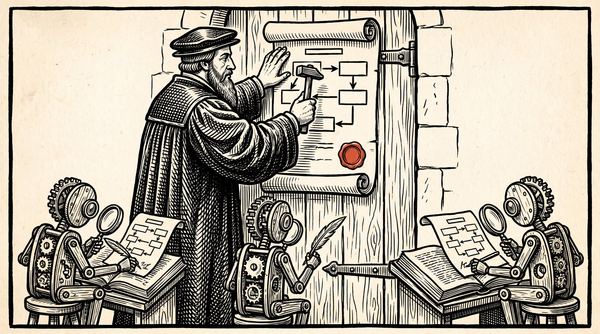
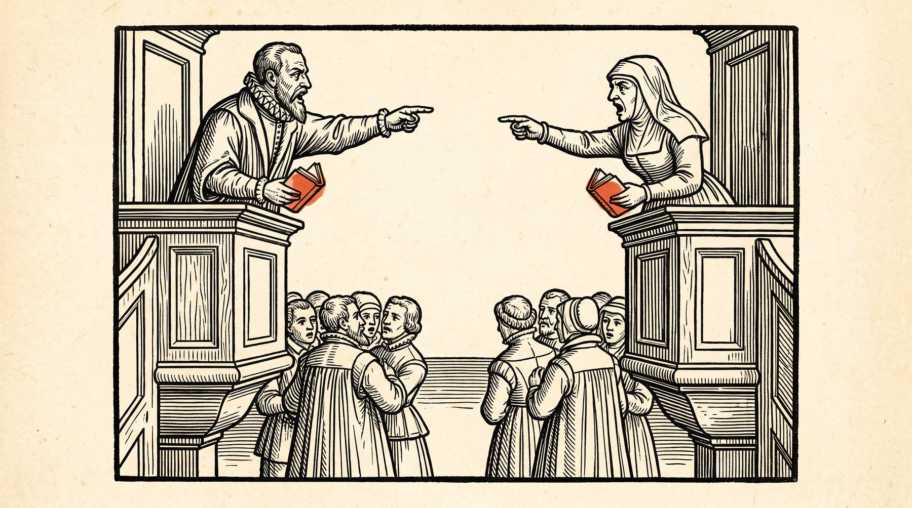
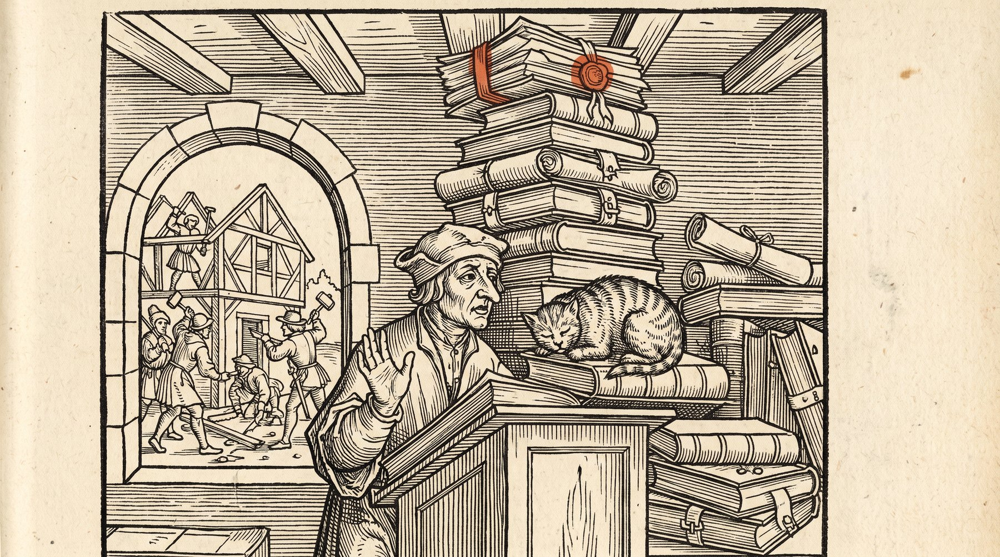
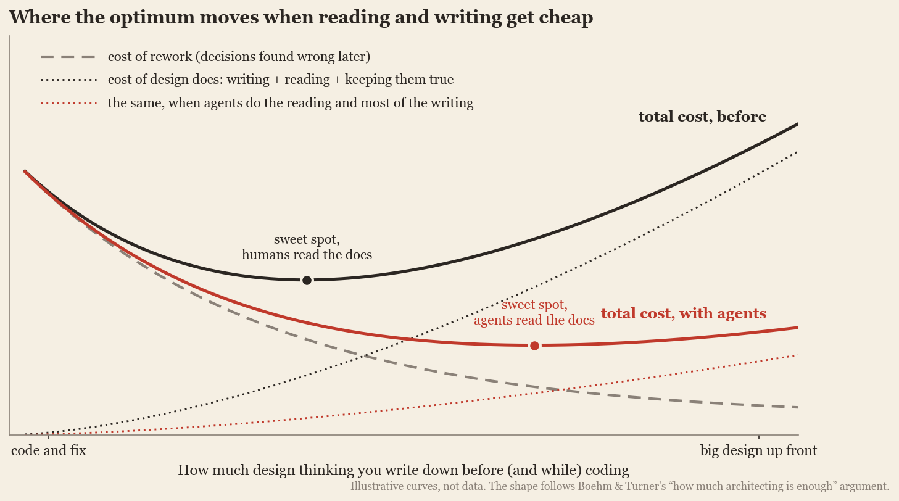
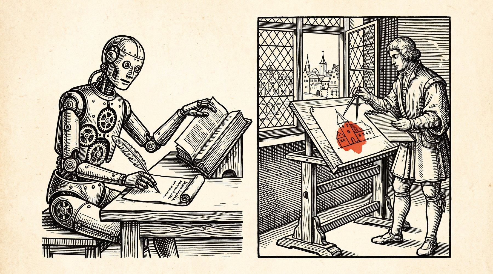

Agility reminds me of a religion that has one denomination per individual.

I have not once met, in my whole career, any developer that didn't agree with "agile". I have met some disconnected "software managers" (with little experience of how software projects actually go) that pushed towards more process, long months of specifications development etc. But never an actual developer. No. We all believe in agility. But then we all disagree on how it should actually be carried out. I've had several times, Alice complaining to me that Bob's approach wasn't agile, not knowing that Bob had already come to me with the same complaint about Alice.

What gives?

Part of the answer is that the word won and the practice didn't. Martin Fowler named the mechanism back in 2006: [semantic diffusion](https://martinfowler.com/bliki/SemanticDiffusion.html), where a term coined with "a pretty good definition" spreads faster than its meaning, until it means whatever the speaker needs. "'Agile' sounds like something you'd certainly want to be," he noted, which is exactly the problem. By 2014 Dave Thomas, one of the Manifesto's seventeen signatories, wrote that "[the word 'agile' has been subverted to the point where it is effectively meaningless](https://pragdave.me/thoughts/active/2014-03-04-time-to-kill-agile.html)", and that forming an industry body around its four values "always struck me as creating a trade union for people who breathe." Ron Jeffries, another signatory, titled a 2018 piece [Developers Should Abandon "Agile"](https://ronjeffries.com/articles/018-01ff/abandon-1/). The surveys tell the same story from the other side: in the [17th State of Agile report](https://www.businesswire.com/news/home/20240116199385/en/17th-State-of-Agile-Report), 71% of respondents said they use agile, only 11% of those said they were very satisfied with it, and 34% said they either build their own framework or follow none at all.

So everyone believes, and almost nobody is satisfied with how their neighbour practises. That is what a religion with one denomination per believer looks like.

But at least we have a common devil. Whatever our denomination, we can gather around the fire and agree on what we are against: **Waterfall**. Or, to give it the full liturgical litany, *Big Design Up Front* (BDUF, which is roughly the sound a requirements binder makes when it lands on your desk), its sibling *Big Requirements Up Front*, *plan-driven development*, *heavyweight methodology*, *document-driven development*, *phase-gate*, and the *V-Model*, which is Waterfall folded in half so it fits in the binder. You know the rite. Months of requirements gathering. Months of specification. A design phase whose deliverable is a document whose deliverable is a signature, after which the document is placed in a shared folder that no living person has opened twice, so that eighteen months later, when the thing ships late and wrong, there exists a signed artifact proving it was supposed to ship on time and right. And then, since nobody can quite bring themselves to let go, the hybrid that Forrester was already calling, in 2011, [Water-Scrum-Fall](https://www.forrester.com/report/water-scrum-fall-is-the-reality-of-agile-for-most-organizations-today/RES60109): Waterfall wearing a Scrum lanyard, two-week sprints sandwiched between a year of planning and a quarterly release.[^1]

. Redrawn from Royce (1970).")

So yes: we can all unite against the big bad wolf of process.

Can we?

The AI revolution is still unfolding, and it seems to me it is one of those moments when even the absolute, universal truths deserve a second look. Including the one universal truth of our profession, the one that even Alice and Bob agree on.

This is me doing that.

## What the bureaucrats got right

Let's steelman the devil for a moment, because the devil had a point. Several, actually.

**Upfront design is where you explore the space before you commit to a path in it.** A good design phase surfaces the tradeoffs while they are still cheap to argue about: this storage model or that one, sync or async, one service or three. Google's internal design-doc practice, as [Malte Ubl describes it](https://www.industrialempathy.com/posts/design-docs-at-google/), exists for "early identification of design issues when making changes is still cheap", and for "scaling knowledge of senior engineers into the organization." Michael Nygard's [Architecture Decision Records](https://cognitect.com/blog/2011/11/15/documenting-architecture-decisions) start from the observation that "one of the hardest things to track during the life of a project is the motivation behind certain decisions," and that without it a newcomer can only choose between "blind acceptance or blind reversal."

**Upfront design is how a team gets aligned.** Ten people writing code in parallel make compatible assumptions, so the pieces fit when they meet. (Everyone nodding in a meeting is a different, cheaper thing.) Architecture is, among other things, the set of decisions you want everyone to make the same way without having to ask.

**And upfront design, done well, buys flexibility in the places that need it.** Even Fowler, the patron saint of evolutionary design, writes that "[in its common usage, evolutionary design is a disaster](https://martinfowler.com/articles/designDead.html)" and "I prefer planned design to 'code and fix'." His own definition of [YAGNI](https://martinfowler.com/bliki/Yagni.html) carries the exception most people skip: it "does not apply to effort to make the software easier to modify." *You aren't gonna need it* is excellent advice about features. It was never meant as advice about seams, which are cheap to put in early and expensive to retrofit.

Where change is genuinely expensive, rigor pays outright. When Amazon engineers [applied formal specification to ten large systems](https://www.amazon.science/publications/how-amazon-web-services-uses-formal-methods), they found bugs "we are sure we would not have found by other means," including one with a 35-step error trace that "had passed unnoticed through extensive design reviews, code reviews, and testing."

What I will *not* use to make this case is the famous claim that a defect costs 100 times more to fix in production than in requirements. That chart has been reproduced in a thousand slide decks, and its provenance is thin: Hillel Wayne went looking for the IBM study it is usually pinned on and, [as The Register reported](https://www.theregister.com/2021/07/22/bugs_expense_bs/), found "one tiny problem with the IBM Systems Sciences Institute study: it doesn't exist," and Laurent Bossavit's [The Leprechauns of Software Engineering](https://leanpub.com/leprechauns) traces the figure back to course notes and decades-old data. The more defensible version is the boring one, from Barry Boehm and Richard Turner's [Balancing Agility and Discipline](https://www.informit.com/store/balancing-agility-and-discipline-a-guide-for-the-perplexed-9780132651806) and from Waterman, Noble and Allan's grounded theory of agile architecture, aptly titled [How Much Up-Front?](https://ieeexplore.ieee.org/document/7194587): the right amount of upfront design depends on how large, how critical and how volatile the system is. Too little raises your risk; too much delays value. There is an optimum, and it moves.

Hold on to that last sentence. It is the whole essay.

## Why we threw it out anyway

Because the optimum, for a long time, sat close to the agile end. Upfront design was a tax, paid in the scarcest currency a software team has: human attention.

**The documents drifted.** In the best-known study of how engineers use documentation, [Lethbridge, Singer and Forward](https://doi.org/10.1109/MS.2003.1241364) found that 68% agreed documentation "is always outdated relative to the current state of a software system." A specification is a second copy of the truth, and the code is the first; the Single Source of Truth principle that every engineer applies to data, heavyweight process violated at the scale of the whole project. (The same study adds a nuance I like: 81% also agreed that documentation "can be useful, even though it might not always be the most up-to-date." Stale isn't worthless. It just can't be trusted blindly, which, in practice, means it gets checked against the code, which means people read the code instead.)

**Nobody read them.** Developers aren't lazy, but reading a sixty-page document carefully, and keeping it in your head while you code, is a large cognitive cost paid upfront for a benefit that arrives later and diffusely. At one company Lethbridge's team observed, engineers consulted documentation in 12 of 357 logged events: 3%. Meanwhile [comprehension already eats about 58% of a developer's working time](https://doi.org/10.1109/TSE.2017.2734091), and that's comprehension of the code alone. Under deadline pressure, the binder loses every time.

**Every attempt to make documents stay true failed on the same rock.** Model-driven engineering promised that the diagrams would *be* the code. In Marian Petre's [interviews with 50 professional developers](https://neverworkintheory.org/2013/06/13/uml-in-practice-2.html), 35 used no UML at all and none used it wholeheartedly; keeping models in sync with code was one of the reasons. The remedies that did survive (doctests, executable specifications, [architectural fitness functions](https://www.thoughtworks.com/radar/techniques/architectural-fitness-function), [ArchUnit](https://www.archunit.org/)) share one trick: a machine checks the document against the code. Hold on to that one too.

So the Agile Manifesto put "[working software over comprehensive documentation](https://agilemanifesto.org/)". People forget the next line, "while there is value in the items on the right, we value the items on the left more", and forget that Jim Highsmith's [account of the Snowbird meeting](https://agilemanifesto.org/history.html) says "we embrace documentation, but not hundreds of pages of never-maintained and rarely-used tomes." The Manifesto never banned the binder. It just priced it honestly, and found it too expensive.

I'm not the first to notice that this looks like a Reformation. Jeff Atwood called software development [a religion](https://blog.codinghorror.com/software-development-its-a-religion/) in 2006, and K. Thomas Ulland has already cast the Manifesto as Luther's theses in [The Agile Reformation](https://acceptancepod.com/the-agile-reformation-a-critical-look-at-the-manifesto/). My twist is in the next act.

## My design docs

I have a confession. For most of my career I have been a closet heretic in the agile church. I wrote design docs. Inordinate amounts of them.

They weren't specifications; I never wanted to tell a developer what to type. What I wrote was closer to a field guide: research on the options available, the tradeoffs between them, the data that backed one choice over another, and the places where option A would bite us if we took it. I wanted to give developers the lay of the land, so they could code with freedom, but with context.

It cost me dearly. Researching and writing those documents ate weeks I could have spent coding. And the developers, who were busy shipping, rarely had time to read them fully. Skimming, mostly. Which is fine, until it isn't: until the moment that reliably came, months later, when the team ran into a problem that the design doc had explicitly predicted, in a section that began with "were we to take option A...". We had taken option A.

There is a special flavour of frustration in being right in a document nobody read. It is not a pleasant flavour, and it does not make you more popular.

## What changed

Two things changed at once, and they compound.

**Writing got cheap.** The research I used to do by hand (surveying libraries, reading papers, comparing approaches, pulling numbers) is now something I direct rather than perform. This essay is a small example: its research notes were compiled by agents working in parallel. But "cheap" comes with an asterisk. Deep-research agents still invent sources: one 2026 audit found that [3% to 13% of the URLs they cite](https://arxiv.org/abs/2604.03173) have no record of ever having existed. So the part of the job that is still mine is the part that was always the point: deciding what matters and checking that it's true. My obsession with data-backed design used to be a personal tax. Now it's closer to a hobby with a fact-checking habit.

. Public domain.")

**Reading got cheap, and this is the bigger deal.** Developers no longer have to read the design doc carefully, because they are no longer its only reader. They point their agentic harness at the ADRs, apply their own development primitives (their skills, their conventions, their prompts), and the agent reads it every time. The Reformation needed two things to happen: the press made scripture cheap to copy, and vernacular translation let ordinary people read it without a priest in between. In this version the agent is both. Every developer's harness reads the design doc in full, in the language of the code it is about to write.

Do agents actually follow what they read? The best evidence so far says yes, with a twist that turned out to matter a great deal to me. In [the first rigorous study of AGENTS.md-style context files](https://arxiv.org/abs/2602.11988), a team at ETH Zurich found that "instructions in the context files are well followed by coding agents." But context files did not generally improve success rates, and raised costs by over 20%. Files generated by an LLM slightly *lowered* success. Repository overviews, "although popular and recommended by model providers, are not helpful." What did help was information the agent could not recover from the repository on its own, such as non-standard practices.

Read that again with my design docs in mind. An agent can read your code faster than you can. What it cannot read off the code is *why*: the options you rejected, the constraint that isn't visible in any file, the "were we to take option A" paragraph. Margaret-Anne Storey calls the absence of that material [intent debt](https://arxiv.org/abs/2603.22106): "the absence of externalized rationale." That is precisely what a good ADR carries, and precisely what the old binders buried under boilerplate. Duncan Davidson put it plainly: [coding agents love decision records](https://duncandavidson.com/agents-love-decisions), because records "help them understand the intent behind the code rather than having to infer it." And Simon Willison, describing what he calls [vibe engineering](https://simonwillison.net/2025/Oct/07/vibe-engineering/): "Write good documentation first and the model may be able to build the matching implementation from that input alone."

In my own work, the result is that implementations now land in the right architectural ballpark far more often than they used to. They're not perfect; agents make mistakes, and so do I. But the gap between "what the design doc said" and "what got built" has shrunk to something I catch in review rather than discover in production.

I should be careful with that claim, though, because I know what self-reports are worth here.

.")

In [METR's 2025 randomised trial](https://arxiv.org/abs/2507.09089), sixteen experienced open-source developers expected AI tools to make them 24% faster, believed afterwards that they had been 20% faster, and were in fact 19% *slower*. The tools have improved a lot since early 2025, and METR's own [2026 follow-up](https://metr.org/blog/2026-02-24-uplift-update/) is honest that its newer data is an "unreliable signal." But the lesson about perception stands. So I will put it this way: in my experience the alignment is dramatically better, I have not measured it, and nobody I know of has measured it for ADRs specifically. The closest study, on what its authors call [constraint decay](https://arxiv.org/abs/2605.06445), is a warning: agents lose about 27 points of test pass rate as structural requirements pile up. Agents read every word, but like us, they get worse as the words multiply.

In the first draft of this essay I wrote that design docs had become "quadratically cheaper": writing got cheaper by some factor, reading by another, so a doc that actually shapes the code got cheaper by their product. I still like the intuition. I just can't show you the data for it, so file it under "argument", not "finding".

## The new equilibrium

For twenty-five years we were told to pick a point on a line, with rigor at one end and speed at the other. Waterfall sat at one end, cowboy coding at the other, and every agile denomination was a different opinion about where on the line to stand.

Agents move the optimum on that line. The costs that made rigor expensive (writing the documents, reading them, keeping the code faithful to them, producing the boilerplate) are exactly the costs agents are good at absorbing. The costs that made speed valuable (learning from working software, changing your mind, talking to users) are still human, and still worth paying.

There is a counterforce, and it deserves a hearing. Agents also make *code* cheap to rewrite, which makes Winston Royce's 1970 advice to "do it twice" (and Fred Brooks's "plan to throw one away") affordable for the first time. Cheap rework pulls the optimum back toward less upfront design. I think both forces are real, and they sort themselves out by kind of decision. A function is cheap to redo. A data model with three years of production data in it is not, and neither is a public API with customers on it, or the boundary between two teams. The decisions worth writing down are the ones agents can't cheaply undo.

So the new equilibrium looks like short iterations, as before, each one steered by a small body of design knowledge (ADRs, design notes, the reasons) that is now cheap to produce, cheap to consult, and actually consulted. DORA's 2025 report found that AI acts as "[an amplifier, magnifying an organization's existing strengths and weaknesses](https://dora.dev/research/2025/dora-report/)", and two of the seven capabilities in its [AI Capabilities Model](https://cloud.google.com/blog/products/ai-machine-learning/introducing-doras-inaugural-ai-capabilities-model) are working in small batches and AI-accessible internal data. That is agility plus scripture.

The tool vendors have noticed. GitHub's [Spec Kit](https://github.blog/2025-09-02-spec-driven-development-with-ai-get-started-with-a-new-open-source-toolkit/), Amazon's Kiro and Tessl all sell some version of "spec-driven development," and [AGENTS.md](https://www.linuxfoundation.org/press/linux-foundation-announces-the-formation-of-the-agentic-ai-foundation) is now a Linux Foundation project that more than 60,000 open-source projects have adopted. The backlash has already arrived, too. François Zaninotto called it [The Waterfall Strikes Back](https://marmelab.com/blog/2025/11/12/spec-driven-development-waterfall-strikes-back.html). Birgitta Böckeler, after trying the tools, wrote: "[To be honest, I'd rather review code than all these markdown files](https://www.martinfowler.com/articles/exploring-gen-ai/sdd-3-tools.html)." One [hands-on trial of Spec Kit](https://blog.scottlogic.com/2025/11/26/putting-spec-kit-through-its-paces-radical-idea-or-reinvented-waterfall.html) produced 2,577 lines of markdown for 689 lines of code.

They're right to worry, and the worry gives me the two caveats this essay owes you.

**The Single Source of Truth problem does not vanish.** An ADR that disagrees with the code is still a liability, and agents follow instructions faithfully, including stale ones. What changes is that keeping them in sync is now cheap enough to actually do. A [2026 study of ADR violations](https://arxiv.org/abs/2602.07609) found LLMs good at spotting violations of decisions that are visible in code, and poor at spotting implicit or deployment-level ones. So write decisions that can be checked, and have them checked, the way doctests and fitness functions taught us.

**The volume of documents can now outgrow anyone's ability to judge them.** A design doc that nobody, human or agent, has thought hard about is just Waterfall's binder, printed faster. The ETH result says the same thing in numbers: generated context hurt, curated context helped. The scarce resource has moved from writing and reading to *judging*, and that one is still ours.

## Machines doing machine work

Here's what I think the old process wars were really about. Bureaucratic software process failed because it asked humans to act like machines: to read every page, remember every constraint, apply every rule consistently, and type out the boilerplate. Humans are bad at that. We rebelled, rightly, and called the rebellion agility.

Agents are good at exactly the parts we were bad at. Hand them the cons of bureaucracy: digesting the rules, reading the specs, generating the scaffolding. That frees developers to move up the abstraction ladder, toward what I'd call *ideas engineering*: deciding what should exist, why, and with which tradeoffs, and writing that down well enough that a tireless reader can act on it.

We keep the agility we love. And we finally get the architectural alignment we always wanted, the one the bureaucrats promised and could never deliver, because they were trying to deliver it with people.

One last thing about Reformations, before anyone gets too triumphant. The real one didn't end the arguments. It multiplied them: once everyone could read the text for themselves, everyone had their own reading, and the denominations bloomed. One per individual, you might say. So Alice and Bob will go on disagreeing about what agile means, and their agents will bring their own primitives, their own skills, their own ways of reading. But for the first time, their agents will have read the same document, all of it. That's not unity. It's a shared text, and it's more than we ever had.

[^1]: The best part is the origin story. The 1970 paper every textbook cites as Waterfall's birth certificate, Winston Royce's [Managing the Development of Large Software Systems](https://web.archive.org/web/2016id_/http://www.cs.umd.edu/class/spring2003/cmsc838p/Process/waterfall.pdf), draws the famous cascade and then says, on the very next page, "I believe in this concept, but the implementation described above is risky and invites failure." He never uses the word "waterfall"; that arrived six years later, in [a paper by Bell and Thayer](https://archive.org/details/software_requirements_are_they_really_a_problem) that meant it kindly. And Royce's cure for the risk was not less process but more: "do it twice," involve the customer, and, on the documentation, "my own view is 'quite a lot'": "the first rule of managing software development is ruthless enforcement of documentation requirements." The single-pass version people actually ran was enshrined in 1985 by a US defense procurement standard, DoD-STD-2167, whose principal author, according to [Craig Larman and Victor Basili's history of iterative development](https://www.craiglarman.com/wiki/downloads/misc/history-of-iterative-larman-and-basili-ieee-computer.pdf), later regretted it: at the time, he "had not heard of iterative development." So Waterfall is that rarest of heresies: one whose founding text warns against it, whose name came later, and whose orthodoxy was imposed by a procurement office. Almost nobody read past the first diagram. Which is the problem this whole essay is about, in a nutshell.
