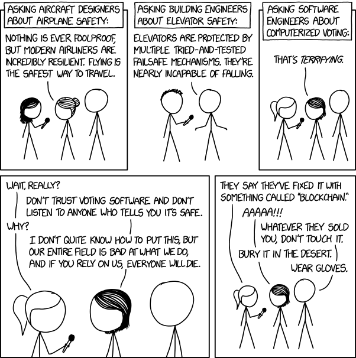

# Software isn't soft enough 

Don't trust software. 
The very name is misleading. Software isn't soft at all. 
It evolved from hardware engineering and bares it's legacy: 
It's binary, it's rigid, it's brittle. 
It's inspired by inanimate machines, not the organic animate. 
It aims for the certain and the exactit but also relies on these and breaks when things are not so. 

The mechanical principles work well for simple systems with simple purposes -- such as buildings or vehicles -- 
but as systems becomes more complex and interconnected, 
we should expect the unexpected to be common. 

Software should be softer to allow enough wiggle room to absorb the 
shock of uncertainty. 

