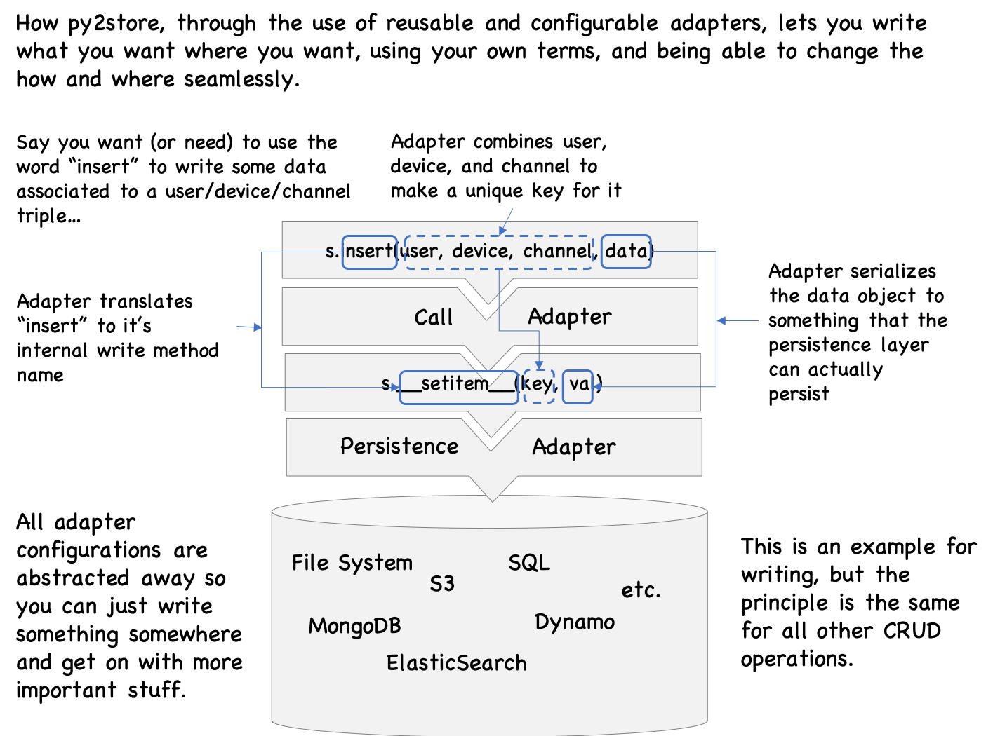

The following investigates the problem of "linguistic entropy" surrounding storage operations and propose 
approaches aimed at maintaining the expression of storage operations only as complex they need to be.

To put it simply but generally, by storage we mean the aspect of reading and writing data (and any derivatives such as deleting, updating, etc.).
This covers a lot of ground, and many particulars of computing come into play -- whether the data is persisted or not, 
locally or remotely, if and how the data is indexed, who has access to what, etc.

Often, these particulars are of no concern to a POC or even MVP. Yet they have to be taken care of to move forward, 
and unfortunately each particular comes with it's own vocabulary and "grammar", even for the most basic operations.

# Write THIS, THERE

Let's say we just want to store THIS, and if it matters, put a THERE label where we stored it. 
Key-value storage. Easy. 

And indeed it should be, yet it often is not. We'll find ourselves opening a file, or a db connection, 
specifying a bunch of parametrization we don't really care about, not only slowing us down and killing our creative spark, 
but by the same token violating multiple good principles 
(such as separation of concerns, convention over configuration, and/or uniform access principle).

# Use cases

## Interfacing reads

How many times did someone share some data with you in the form of a zip of some nested folders 
whose structure and naming choices are fascinatingly obscure? And how much time do you then spend to write code 
to interface with that freak of nature? Well, one of the intents of py2store is to make that easier to do. 
You still need to understand the structure of the data store and how to deserialize these datas into python 
objects you can manipulate. But with the proper tool, you shouldn't have to do much more than that.

## Changing where and how things are stored

Ever have to switch where you persist things (say from file system to S3), or change the way key into your data, 
or the way that data is serialized? If you use py2store tools to separate the different storage concerns, 
it'll be quite easy to change, since change will be localized. And if you're dealing with code that was already 
written, with concerns all mixed up, py2store should still be able to help since you'll be able to
more easily give the new system a facade that makes it look like the old one. 

All of this can also be applied to data bases as well, in-so-far as the CRUD operations you're using 
are covered by the base methods.

## Adapters: When the learning curve is in the way of learning

Shinny new storage mechanisms (DBs etc.) are born constantly, and some folks start using them, and we are eventually lead to use them 
as well if we need to work with those folks' systems. And though we'd love to learn the wonderful new 
capabilities the new kid on the block has, sometimes we just don't have time for that. 

Wouldn't it be nice if someone wrote an adapter to the new system that had an interface we were familiar with? 
Talking to SQL as if it were mongo (or visa versa). Talking to S3 as if it were a file system. 
Now it's not a long term solution: If we're really going to be using the new system intensively, we 
should learn it. But when you just got to get stuff done, having a familiar facade to something new 
is a life saver. 

py2store would like to make it easier for you roll out an adapter to be able to talk 
to the new system in the way **you** are familiar with.
 
## Thinking about storage later, if ever

You have a new project or need to write a new app. You'll need to store stuff and read stuff back. 
Stuff: Different kinds of resources that your app will need to function. Some people enjoy thinking 
of how to optimize that aspect. I don't. I'll leave it to the experts to do so when the time comes. 
Often though, the time is later, if ever. Few proof of concepts and MVPs ever make it to prod. 

So instead, I'd like to just get on with the business logic and write my program. 
So what I need is an easy way to get some minimal storage functionality. 
But when the time comes to optimize, I shouldn't have to change my code, but instead just change the way my 
DAO does things. What I need is py2store.

# py2store: A working example in python

See/get it here: https://github.com/i2mint/py2store

Storage CRUD how and where you want it.

List, read, write, and delete data in a structured data source/target, 
as if manipulating simple python builtins (dicts, lists), or through the interface **you** want to interact with, 
with configuration or physical particularities out of the way. 
Also, being able to change these particularities without having to change the business-logic code. 

## How py2store works

py2store offers three aspects that you can define or modify to store things where you like and how you like it:
* **Persistence**: Where things are actually stored (memory, files, DBs, etc.)
* **Serialization**: Value transformaton. 
How python objects should be transformed before it is persisted, 
and how persisted data should be transformed into python objects.
* **Indexing**: Key transformation. How you name/id/index your data. 
Full or relative paths. Unique combination of parameters (e.g. (country, city)). Etc.

All of this allows you to do operations such as "store this (value) in there (persitence) as that (key)", 
moving the tedious particularities of the "in there" as well how the "this" and "that" are transformed to fit 
in there, all out of the way of the business logic code. The way it should be.



Note: Where data is actually persisted just depends on what the base CRUD methods 
(`__getitem__`, `__setitem__`, `__delitem__`, `__iter__`, etc.) define them to be. 


# A peep of how it looks like in practice

Install it (e.g. `pip install py2store`).

Think of type of storage you want to use and just go ahead, like you're using a dict.
Here's an example for local storage (you must you string keys only here). 

```
>>> from py2store import QuickStore
>>>
>>> store = QuickStore()  # will print what (tmp) rootdir it is choosing
>>> # Write something and then read it out again
>>> store['foo'] = 'baz'
>>> 'foo' in store  # do you have the key 'foo' in your store?
True
>>> store['foo']  # what is the value for 'foo'?
'baz'
>>>
>>> # Okay, it behaves like a dict, but go have a look in your file system,  
>>> # and see that there is now a file in the rootdir, named 'foo'!
>>> 
>>> # Write something more complicated
>>> store['hello/world'] = [1, 'flew', {'over': 'a', "cuckoo's": map}]
>>> stored_val = store['hello/world']
>>> stored_val == [1, 'flew', {'over': 'a', "cuckoo's": map}]  # was it retrieved correctly?
True
>>>
>>> # how many items do you have now?
>>> assert len(store) >= 2  # can't be sure there were no elements before, so can't assert == 2
>>> 
>>> # delete the stuff you've written
>>> del store['foo']
>>> del store['hello/world']
```

`QuickStore` will by default store things in local files, using pickle as the serializer.
If a root directory is not specified, 
it will use a tmp directory it will create (the first time you try to store something) 
It will create any directories that need to be created to satisfy any/key/that/contains/slashes.
Of course, everything is configurable.
